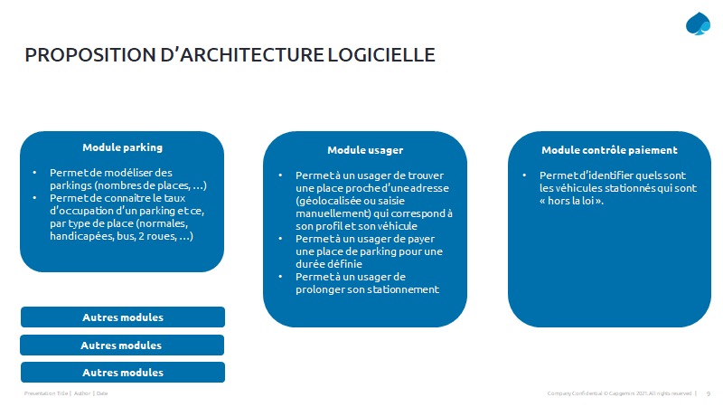

# Care & Park

Projet fictif de gestion d'un parc automobile pour une agglomération française

## Scénario et contexte du projet 

Votre société a répondu à un appel d’offre public pour une très grande agglomeration en France .
Ce marché concerne la gestion des places de parking, le paiement du stationnement et le  suivi de celles-ci.

Ceci pour permettre l’étude des usages, la verification du paiement des usagers et les délits de stationnement ( stationnement sur trottoir etc.).

A terme cela permettra d’améliorer la fluidification des véhicules et la modification des habitudes du “dernier kilomètre”.Les solutions devront être compatibles avec les nouvelles zones à faible émissions pour la  circulation et la stationnement, il faudra prendre en compte la nouvelle réglementation sur le stationnement payant  des 2 et 3 roues.

Il y aura un enjeu sur les  occupations des nouveaus modes de déplacements type trotinette électrique , scooter électrique de société “uberisées” qui stationnent de manière erratique.le marché nécessite plusieurs  études et outils  qui permettront  la modification et l’ évolution du système d’information de l’agglomeration :
* Mise en place d’un outil de suivi en temps réel des places de parking utilisées
* Enregistrement ( par capteur et/ou identification par video des plaques immatriculation ) ( type de véhicule, électrique ou non par exemple ) pour l’ étude des données et des usages ( temps et occupation des places de parking )
* Mise en place de terminaux mobiles pour le prestataire municipale ( ayant delegation par la mairie ) et la police chargé du contrôle du paiement du stationnement ( à distance ou non)
* Interface pour les usagers des places de parking pour le suivi  et paiement à distance ( dans la limite de temps défini par la mairie  et les lois sur les zones de stationnement )

### Code du projet 

Le code fourni dans ce repositoy est du langage Java permettant de fournir une base permettant le développement de quelques usescases défini ( voir l'architecture fonctionnelle ).
Ce code servira de base pour les cours sur GIt advanced,  DevOps ( chaîne CI-CD ) et le cours sur le TDD.

### Architecture fonctionnelle

